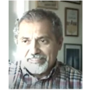
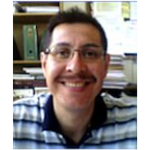
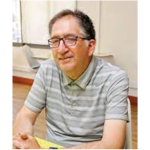
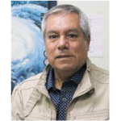
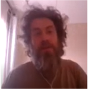
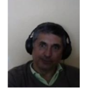
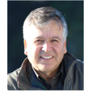
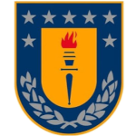
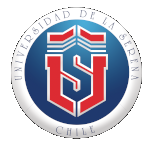
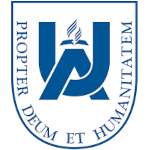

# Quienes somos

El observatorio Cientifico Escolar es una iniciativa de docentes de distintos establecimientos de educación superior (Universidad de Concepción, Universidad de la Serena, Universidad Adventista actualmente [28-04-2021]), que estamos comprometidos y alineados con los procesos de desarrollo y de descentralización en la región y el país, buscando con interés el desarrollo libre de los individuos, en especial de la comunidad liceana, donde profesores y estudiantes elaboran parte del fundamento de nuestra sociedad. A la vez que construimos acciones preventivas frente a los problemas ambientales y sociales que estamos enfrentando los desafíos en red.

# Equipo

|Equipo|
|---|---|---|---|
||**Dr. Elías Ovalle M.** (IP), Facultad  de Ciencias Físicas y Matemáticas. Departamento de Geofísica. Universidad de Concepción Campus Concepción||**M.Sc. Gustavo Godoy U.**, Escuela de Ciencias y Tecnologías. Departamento de Ciencias Geodésicas y Geomática. Universidad de Concepción Campus Los Ángeles|
||**MSc. Victor Villagrán O.**, Facultad  de Ciencias Físicas y Matemáticas. Departamento de Geofísica. Universidad de Concepción Campus Concepción||**Dr. Juan Inzunza B.**, Facultad  de Ciencias Físicas y Matemáticas. Departamento de Geofísica. Universidad de Concepción Campus Concepción|
||**Dr. Pablo Muñoz**, Facultad de Ciencias. Departamento de Física y Astronomía, Universidad de la Serena||**Mg. Luis Tamblay V.**, Facultad de Ciencias. Departamento de Física y Astronomía, Universidad de la Serena|
||**Mg. Carlos Villalobos**, Facultad de Educación. Universidad Adventista de Chile||**Dr. Jesús Piña**, Escuela de Ciencias y Tecnologías. Departamento de Ciencias Geodésicas y Geomática. Universidad de Concepción Campus Los Ángeles|

Docentes de tres Universidades

|UdeC|ULS|UnACh|
|---|---|---|
||||

# Modelo de colaboración

## Liceos Adheridos

1. 20190418 Liceo Padre Luis Saldes Irarrazabal, Yumbel.
2. 20210311 Colegio Adventista de Chile, Chillán.
3. 20210420 Liceo Bicentenario, Los Ángeles.

## Universidades

1. Universidad de Concepción (UdeC)
2. Universidad de la Serena (ULS)
3. Universidad de Adventista de Chile (UnACh)

