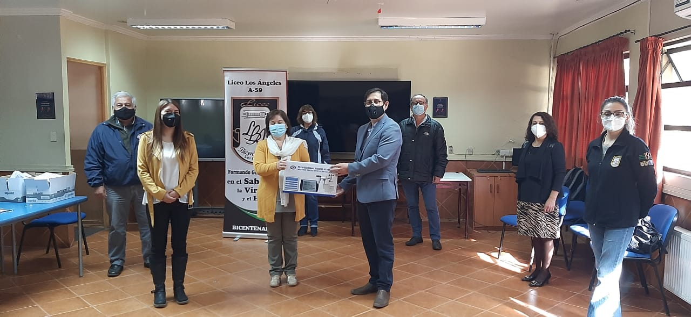
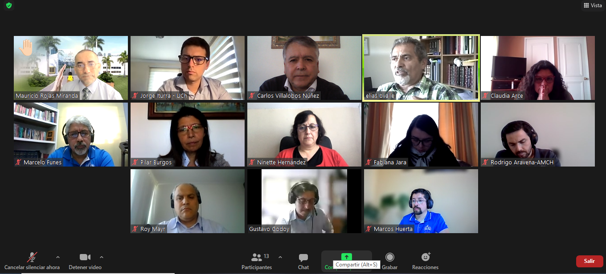
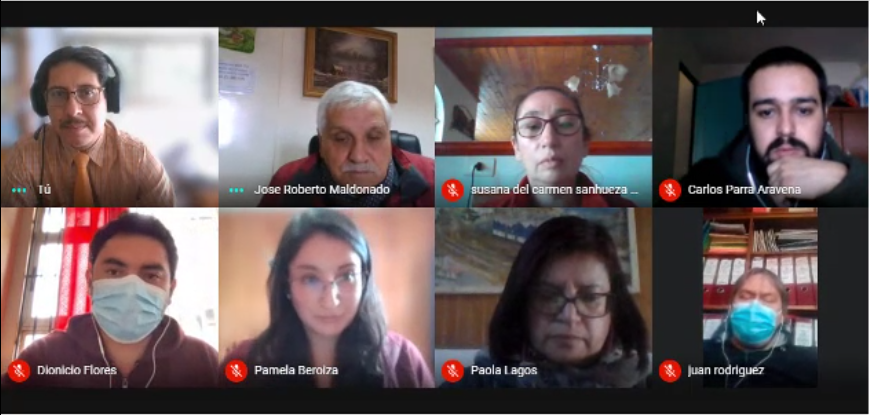

## 20200117 Primer Liceo de Chile que compra e instala estación metereológica para su uso en las actividades de enseñanza
Descripción próximamente

## 20210420 Primer Liceo de la comuna de Los Angeles que se adhiere a la la red OCRE

La entrevista queda regitsrada por radio Biobio. Puede ver el reportaje en  https://www.facebook.com/10383924671/posts/10160241711714672/?sfnsn=mo

## 20210427 Miembros del OCRE sostienen reunión con Representantes de Fundaciones de Colegios Adventistas a nivel Nacional en busca de cooperación.

## 20210428 Reunión con Director Comunal, Director y Profesores Liceo Polivalente Puerto Seco, Región de Ñuble.

	                       

	

	
